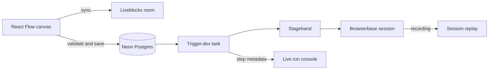

# Browser Automation Agent

## Workflow Nodes

| Node       | Description                                               | Outputs                        |
| ---------- | --------------------------------------------------------- | ------------------------------ |
| Start      | Starts a connected workflow                               | None                           |
| Open URL   | Navigates the shared browser session to a URL             | URL, title                     |
| Act        | Performs a natural-language browser action                | Success, message, URL          |
| Extract    | Extracts page content from a natural-language instruction | Extraction                     |
| Observe    | Finds matching browser elements and actions               | Matches, selector, description |
| Agent      | Runs a multi-step autonomous browser task                 | Success, message, completed    |
| Send Email | Sends an HTML email through Resend                        | Email ID                       |

## Prerequisites

- Node.js and npm
- Clerk application with Organizations enabled
- PostgreSQL database (such as Neon)
- Trigger.dev project
- Liveblocks project
- Browserbase account
- Resend account
- Optional Sentry project for error monitoring and source maps

## Installation

```bash
npm install
```

## Configuration

Copy `.env.example` to `.env.local` and configure:

```bash
NEXT_PUBLIC_CLERK_SIGN_IN_URL=/sign-in
NEXT_PUBLIC_CLERK_SIGN_UP_URL=/sign-up
NEXT_PUBLIC_CLERK_SIGN_IN_FALLBACK_REDIRECT_URL=/
NEXT_PUBLIC_CLERK_SIGN_UP_FALLBACK_REDIRECT_URL=/

NEXT_PUBLIC_CLERK_PUBLISHABLE_KEY=
CLERK_SECRET_KEY=

NEON_BRANCH=main
DATABASE_URL=
DATABASE_URL_UNPOOLED=

TRIGGER_SECRET_KEY=

NEXT_PUBLIC_LIVEBLOCKS_PUBLIC_KEY=
LIVEBLOCKS_SECRET_KEY=

BROWSERBASE_API_KEY=
RESEND_API_KEY=

NEXT_PUBLIC_SENTRY_DSN=
SENTRY_DSN=
SENTRY_AUTH_TOKEN=
```

### Clerk Setup

Create a Clerk application with Organizations enabled. For paid features, configure Clerk Billing with an organization plan slug `pro`.

## Database Setup

Generate and apply migrations:

```bash
npm run db:generate
npm run db:migrate
```

For local development:

```bash
npm run db:push
```

## Running the Application

Start Trigger.dev worker:

```bash
npx trigger.dev dev
```

Start the application:

```bash
npm run dev
```

## Deployment

### Railway Deployment

Build and start commands:

| Setting       | Value           |
| ------------- | --------------- |
| Build command | `npm run build` |
| Start command | `npm start`     |

### Production Environment Variables

Same as `.env.local` with production credentials.

### Production Deployment Steps

1. Apply database migrations:

```bash
npm run db:migrate
```

2. Deploy to Trigger.dev:

```bash
npx trigger.dev deploy
```

## Architecture



## Project Structure

```text
app/
├── (auth)/                     # Clerk authentication
├── (dashboard)/                # Workflow dashboard and editor
└── api/                        # API routes
components/
└── ui/                         # Shared UI components
features/
└── workflows/
    ├── components/             # Canvas and workflow UI
    ├── nodes/                  # Node implementations
    └── tasks/                  # Trigger.dev tasks
lib/
└── db/                         # Drizzle schema and migrations
```

## Scripts

| Command               | Description              |
| --------------------- | ------------------------ |
| `npm run dev`         | Start development server |
| `npm run build`       | Create production build  |
| `npm start`           | Start production server  |
| `npm run lint`        | Run ESLint               |
| `npm run typecheck`   | Run TypeScript check     |
| `npm run db:generate` | Generate migrations      |
| `npm run db:migrate`  | Apply migrations         |
| `npm run db:push`     | Push schema to database  |
| `npm run db:studio`   | Open Drizzle Studio      |

## Tech Stack

| Technology            | Purpose                        |
| --------------------- | ------------------------------ |
| Next.js 16 + React 19 | Application framework          |
| React Flow            | Visual workflow canvas         |
| Liveblocks            | Real-time collaboration        |
| Trigger.dev           | Durable workflow execution     |
| Stagehand             | AI browser automation          |
| Browserbase           | Managed browser sessions       |
| Clerk                 | Authentication & organizations |
| Neon + Drizzle        | Serverless Postgres            |
| Resend                | Email integration              |
| Sentry                | Error monitoring               |
